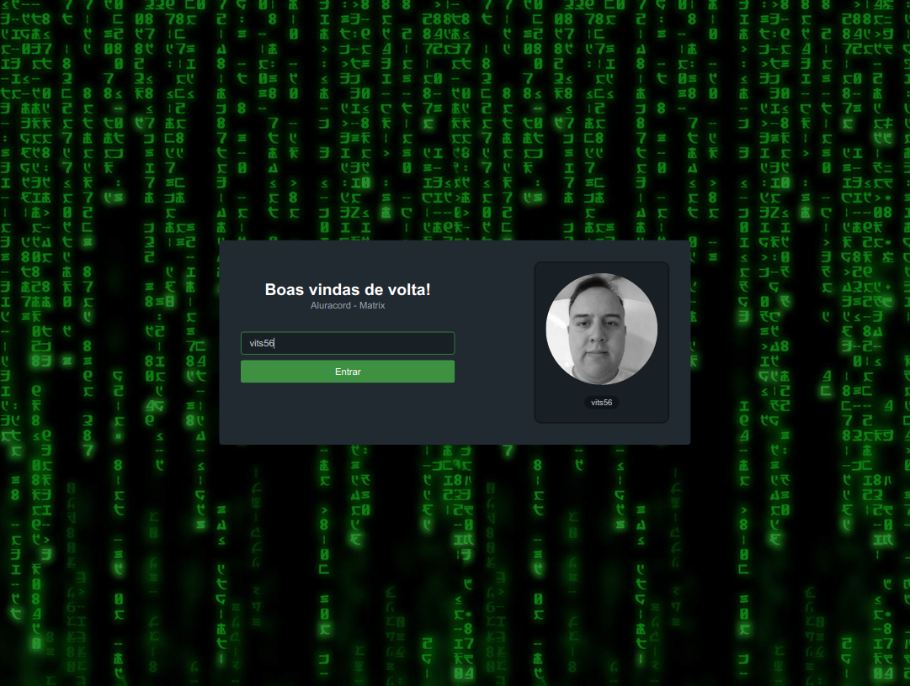
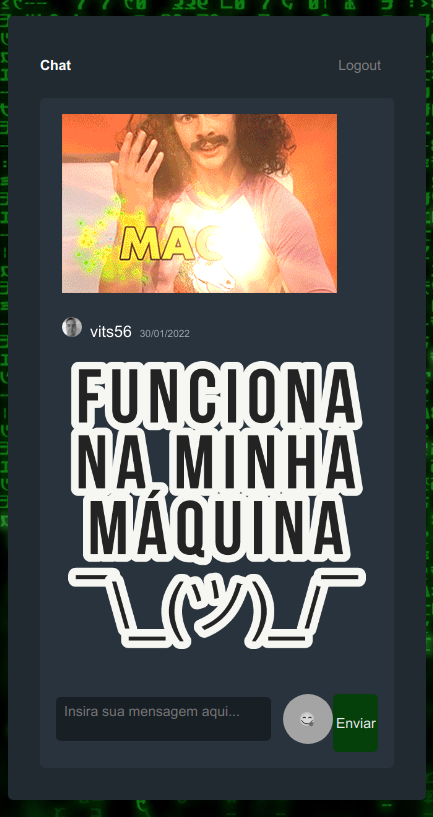

<div align="center" id="top"> 
  
</div>

<hr/>
<br>

## Sobre
# aluracord-matrix
👨‍💻 Projeto criado na Imersão React com a @alura @omariosouto @peas


## Screenshots

<div align="center" id="top"> 
  
</div>
<br/>
<br/>
<div align="center" id="top"> 
  
</div>

## Features

- 
- 
- 

## Technologies

The following tools were used in this project:

- [React](https://pt-br.reactjs.org/)
- [Next](https://nextjs.org/)
- [Skynexui](https://skynexui.dev/)


## Requirements

Before starting 🏁, you need to have [Git](https://git-scm.com) and [Node](https://nodejs.org/en/) installed.

## Starting

```bash
# Clone this project
$ git clone https://github.com/vits56/aluracord-matrix

# Access
$ cd aluracord-matrix

# Install dependencies
$ yarn

# Run the project
$ yarn start

# The server will initialize in the <http://localhost:3000>
```

## License

This project is under license from MIT. For more details, see the [LICENSE](LICENSE.md) file.

Made with 💜 by <a href="https://github.com/vits56" target="_blank">Bruno Bastos Duarte</a>

&#xa0;

<a href="#top">Back to top</a>


